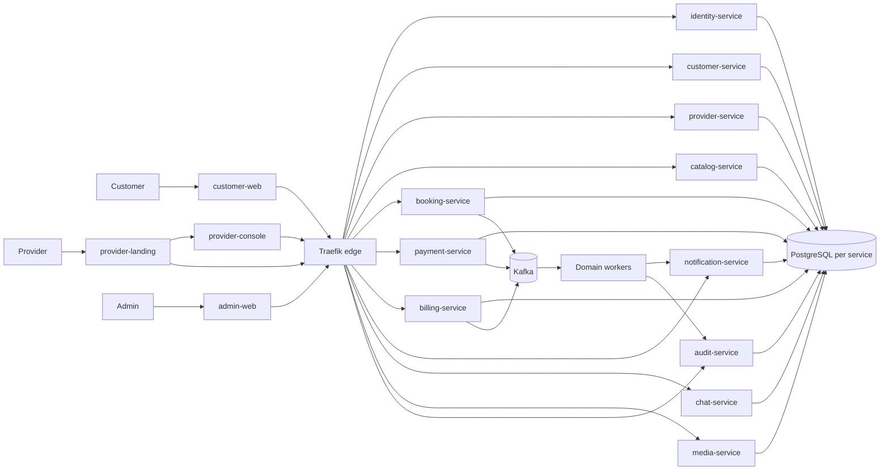
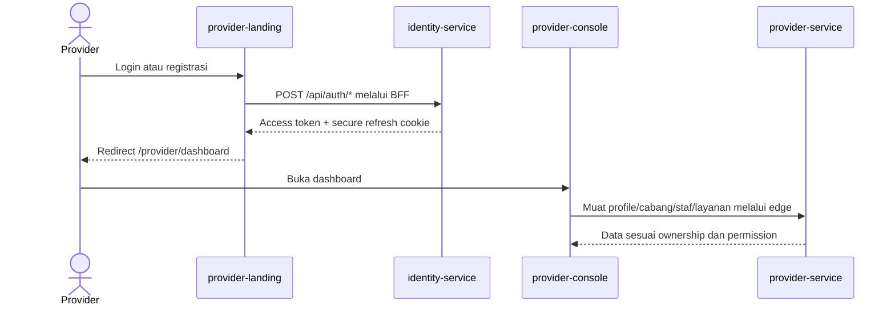
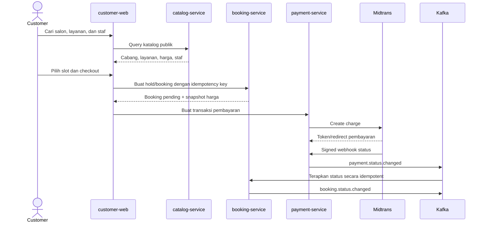

# Alur aplikasi TakeIn

Dokumen ini memetakan runtime Go/Next yang aktif. Customer, provider, dan admin
masuk melalui aplikasi Next.js terpisah; seluruh keputusan bisnis dijalankan oleh
service Go pemilik domain.

## Alur tingkat sistem

## Login dan routing provider

## Booking dan pembayaran customer

## Prinsip konsistensi

- Service hanya menulis database miliknya.
- Operasi sinkron lintas domain menggunakan gRPC internal.
- Side effect memakai Kafka, inbox/outbox, retry terbatas, dan DLQ.
- Booking/payment menggunakan transaction, constraint, row lock yang relevan,
  serta idempotency key.
- Notification, chat, media, dan audit tidak boleh menggagalkan commit bisnis
  hanya karena delivery downstream sementara tidak tersedia.
